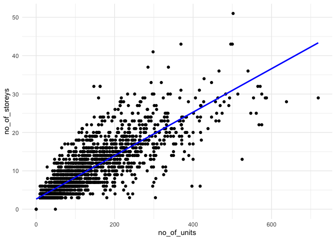
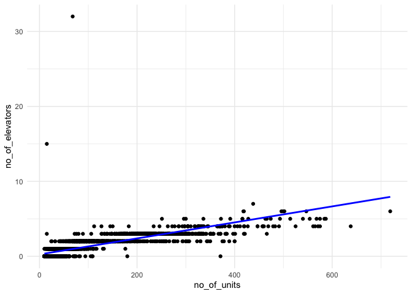

STAT545B - Assignment 1
================
Hehan (Zoe) Zhang
2023-11-03

``` r
library(dplyr)
```

    ## 
    ## Attaching package: 'dplyr'

    ## The following objects are masked from 'package:stats':
    ## 
    ##     filter, lag

    ## The following objects are masked from 'package:base':
    ## 
    ##     intersect, setdiff, setequal, union

``` r
library(datateachr)
library(tidyverse)
```

    ## Warning: package 'tidyverse' was built under R version 4.1.2

    ## Warning: package 'ggplot2' was built under R version 4.1.2

    ## Warning: package 'tibble' was built under R version 4.1.2

    ## Warning: package 'tidyr' was built under R version 4.1.2

    ## Warning: package 'readr' was built under R version 4.1.2

    ## Warning: package 'purrr' was built under R version 4.1.2

    ## Warning: package 'stringr' was built under R version 4.1.2

    ## Warning: package 'forcats' was built under R version 4.1.2

    ## Warning: package 'lubridate' was built under R version 4.1.2

    ## ── Attaching core tidyverse packages ──────────────────────── tidyverse 2.0.0 ──
    ## ✔ forcats   1.0.0     ✔ readr     2.1.4
    ## ✔ ggplot2   3.4.2     ✔ stringr   1.5.0
    ## ✔ lubridate 1.9.2     ✔ tibble    3.2.1
    ## ✔ purrr     1.0.1     ✔ tidyr     1.3.0

    ## ── Conflicts ────────────────────────────────────────── tidyverse_conflicts() ──
    ## ✖ dplyr::filter() masks stats::filter()
    ## ✖ dplyr::lag()    masks stats::lag()
    ## ℹ Use the conflicted package (<http://conflicted.r-lib.org/>) to force all conflicts to become errors

``` r
library(testthat)
```

    ## 
    ## Attaching package: 'testthat'
    ## 
    ## The following object is masked from 'package:purrr':
    ## 
    ##     is_null
    ## 
    ## The following objects are masked from 'package:readr':
    ## 
    ##     edition_get, local_edition
    ## 
    ## The following object is masked from 'package:tidyr':
    ## 
    ##     matches
    ## 
    ## The following object is masked from 'package:dplyr':
    ## 
    ##     matches

My function idea: When I did the mini data analysis 2 on examining the
relationships between 2 variables, I keep producing the figure between
two numeric columns’ variables and checking if there’s a linear
relationship between them, thus I would like make a plot function on
examining 2 variables’ linear relationship.

``` r
# Exercise 1 & Exercise 2
#' Title: Linear Relationship Plot between Two Variables
#'
#' Function Description: Quickly generates a scatter plot to examine the linear relationship between two specified variables in a given data frame. It fits a linear model (lm) to the data and adds it to the plot.
#'
#' @param df A data frame containing the variables to be plotted, the abbreviation of dataframe is always used as df.
#' @param x_var The name of the independent variable column in the data frame as a string, dependent variable is always represented as x variable in statistics, so we get the abbreviation here, as x_var.
#' @param y_var The name of the dependent variable column in the data frame as a string, dependent variable is always represented as y variable in statistics, so we get the abbreviation here, as y_var.
#' @param na.rm Logical. Whether to remove rows with missing values (NA) in the specified columns before plotting. I set the default as FALSE.
#' @param ... Additional arguments passed to geom_smooth() function for customization.
#'
#' @return A ggplot object representing the scatter plot with a linear fit. The plot can be further modified or directly displayed.

lm_check <- function (df, x_var, y_var, na.rm = FALSE, ...) {
  # Check if variables exist in the dataframe
  if (!(x_var %in% names(df)) || !(y_var %in% names(df))) {
    stop("Variables not found in the dataframe.")
  }
  # Check for zero-length data
  if (nrow(df) == 0) {
    stop("data must have at least 1 row to plot")
  }
  # Prepare data, remove missing values if na.rm is TRUE
  data_to_plot <- df
  if (na.rm) {
    data_to_plot <- na.omit(data_to_plot[, c(x_var, y_var)])
  }
  # Create the plot
  plot <- ggplot(data_to_plot, aes_string(x = x_var, y = y_var)) +
    geom_point() +
    geom_smooth(method = "lm", color = "blue", se = FALSE, ...) +
    theme_minimal() 
  return(plot)
}
```

``` r
# Check for the dataset apt_buildings
head (apt_buildings)
```

    ## # A tibble: 6 × 37
    ##      id air_conditioning amenities balconies barrier_free_accessi…¹ bike_parking
    ##   <dbl> <chr>            <chr>     <chr>     <chr>                  <chr>       
    ## 1 10359 NONE             Outdoor … YES       YES                    0 indoor pa…
    ## 2 10360 NONE             Outdoor … YES       NO                     0 indoor pa…
    ## 3 10361 NONE             <NA>      YES       NO                     Not Availab…
    ## 4 10362 NONE             <NA>      YES       YES                    Not Availab…
    ## 5 10363 NONE             <NA>      NO        NO                     12 indoor p…
    ## 6 10364 NONE             <NA>      NO        NO                     Not Availab…
    ## # ℹ abbreviated name: ¹​barrier_free_accessibilty_entr
    ## # ℹ 31 more variables: exterior_fire_escape <chr>, fire_alarm <chr>,
    ## #   garbage_chutes <chr>, heating_type <chr>, intercom <chr>,
    ## #   laundry_room <chr>, locker_or_storage_room <chr>, no_of_elevators <dbl>,
    ## #   parking_type <chr>, pets_allowed <chr>, prop_management_company_name <chr>,
    ## #   property_type <chr>, rsn <dbl>, separate_gas_meters <chr>,
    ## #   separate_hydro_meters <chr>, separate_water_meters <chr>, …

``` r
apt_buildings <- apt_buildings %>% 
  filter(no_of_units <= 1000)
```

``` r
# Exercise 3 (Example 1) - check the linear relationship between no_of_units and no_of_storeys in apt_buildings dataset and fit a linear regression line, we can see that there's a positive relationship between no_of_units and no_of_storeys. 
check1 <- lm_check(df = apt_buildings, x_var = "no_of_units", y_var = "no_of_storeys", na.rm = TRUE)
```

    ## Warning: `aes_string()` was deprecated in ggplot2 3.0.0.
    ## ℹ Please use tidy evaluation idioms with `aes()`.
    ## ℹ See also `vignette("ggplot2-in-packages")` for more information.
    ## This warning is displayed once every 8 hours.
    ## Call `lifecycle::last_lifecycle_warnings()` to see where this warning was
    ## generated.

``` r
print(check1)
```

    ## `geom_smooth()` using formula = 'y ~ x'

<!-- -->

``` r
# Exercise 3 (Example 2) - check the relationship between no_of_units and no_of_elevators in apt_buildings dataset and fit a linear regression line, we can see that there's a positive relationship between no_of_units and no_of_elevators. 
check2 <- lm_check(df = apt_buildings, x_var = "no_of_units", y_var = "no_of_elevators", na.rm = TRUE)
print(check2)
```

    ## `geom_smooth()` using formula = 'y ~ x'

<!-- -->

``` r
# Exercise 4
# Test 1: Check that the function returns a ggplot object with valid input and no NAs
test_that("lm_check returns a ggplot object with no NAs", {
  data <- data.frame(x = 1:10, y = 1:10) # Vector with no NAs
  expect_is(lm_check(data, "x", "y"), "ggplot", 
            info = "lm_check should return a ggplot object with valid input and no NAs.")
})
```

    ## Test passed 🎉

``` r
# Test 2: Check that the function still works and omits NAs when na.rm is TRUE
test_that("lm_check handles NAs correctly when na.rm is TRUE", {
  data_with_na <- data.frame(x = c(1:5, NA, 7:10), y = c(1:5, NA, 7:10)) # Vector with NAs
  plot <- lm_check(data_with_na, "x", "y", na.rm = TRUE)
  expect_is(plot, "ggplot", 
            info = "lm_check should handle NAs correctly when na.rm is TRUE.")
  expect_equal(sum(is.na(data_with_na$x)), 1, 
               info = "There should be exactly one NA in the test data.")
})
```

    ## Test passed 😀

``` r
# Test 3: Check for correct error message when supplied with a vector of length 0
test_that("lm_check handles vector of length 0 correctly", {
  data_empty <- data.frame(x = numeric(0), y = numeric(0)) # Vector of length 0
  expect_error(lm_check(data_empty, "x", "y"), 
               "data must have at least 1 row to plot", 
               info = "lm_check should error with informative message when vector length is 0.")
})
```

    ## Test passed 😸
